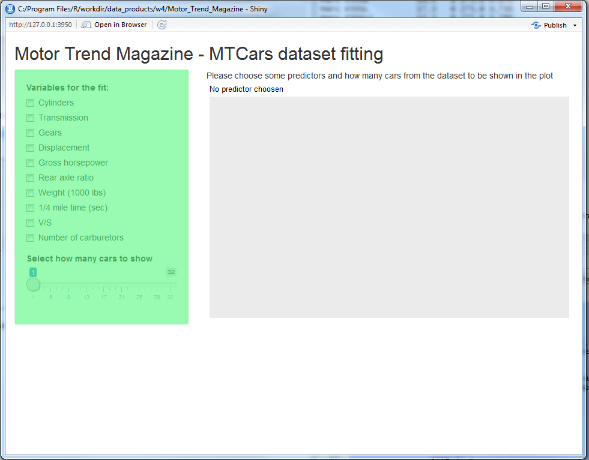
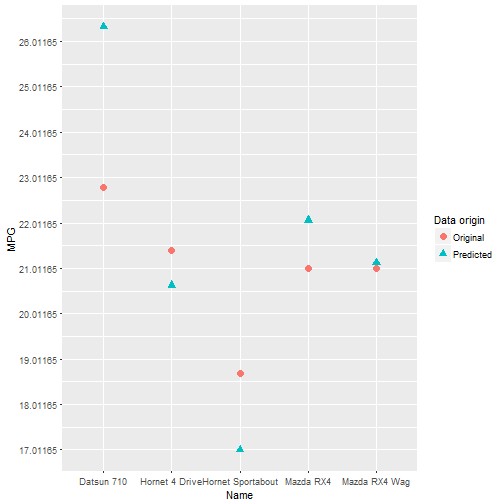

<style>

.reveal h3 { 
  font-size: 30px;
  color: red;
}

.reveal .slides section .slideContent {
   font-size: 20px;
   color: black;
}

</style>

Motor Trend Magazine - MTCars dataset fitting
========================================================
author: Andrea Fatutta
date: 18 april 2017
autosize: true
font-family: 'Helvetica'

Introduction
========================================================


This projects will analyze the R MTCars dataset (*) and calculate a linear model fit for the variables selected.

Below a short summary:


```
'data.frame':	32 obs. of  11 variables:
 $ mpg : num  21 21 22.8 21.4 18.7 18.1 14.3 24.4 22.8 19.2 ...
 $ cyl : num  6 6 4 6 8 6 8 4 4 6 ...
 $ disp: num  160 160 108 258 360 ...
 $ hp  : num  110 110 93 110 175 105 245 62 95 123 ...
 $ drat: num  3.9 3.9 3.85 3.08 3.15 2.76 3.21 3.69 3.92 3.92 ...
 $ wt  : num  2.62 2.88 2.32 3.21 3.44 ...
 $ qsec: num  16.5 17 18.6 19.4 17 ...
 $ vs  : num  0 0 1 1 0 1 0 1 1 1 ...
 $ am  : num  1 1 1 0 0 0 0 0 0 0 ...
 $ gear: num  4 4 4 3 3 3 3 4 4 4 ...
 $ carb: num  4 4 1 1 2 1 4 2 2 4 ...
```

```
                   mpg cyl disp  hp drat    wt  qsec vs am gear carb
Mazda RX4         21.0   6  160 110 3.90 2.620 16.46  0  1    4    4
Mazda RX4 Wag     21.0   6  160 110 3.90 2.875 17.02  0  1    4    4
Datsun 710        22.8   4  108  93 3.85 2.320 18.61  1  1    4    1
Hornet 4 Drive    21.4   6  258 110 3.08 3.215 19.44  1  0    3    1
Hornet Sportabout 18.7   8  360 175 3.15 3.440 17.02  0  0    3    2
Valiant           18.1   6  225 105 2.76 3.460 20.22  1  0    3    1
```
<small>*(&ast;) Source: Henderson and Velleman (1981), Building multiple regression models interactively. Biometrics, 37, 391-411.*</small>


Application description
========================================================
The app will start with the following empty screen, nothing is plotted or selected but you will have some **input boxes** and **slider** to play with.



If you tick one or more **boxes** a plot will be created for how many cars you have selected with the **slider**. Please be aware that you might not have a monitor large enough to easily see all cars plotted.


Application example:
========================================================

Here below an example of the plot generated if you select 5 cars with the slide bar and boxes ticked for **"Cylinders"**, **"Displacement"** and **"Weight"**.



Code and links
========================================================

```r
mtcars_temp <- mtcars[, c(1,2,3,6)]
      mtcars_temp$name <- rownames(mtcars)
      fit<- lm( mpg ~ . - name , data=mtcars_temp)
      mtcars_temp<-mtcars_temp[1:5,]
      mtcars_temp$valType <- "Original"
      
      mtcars_plot<-rbind(
          mtcars_temp[,c("mpg","name","valType")],
          cbind(cbind(mpg = predict(fit, mtcars_temp)),name=mtcars_temp$name, valType=rep("Predicted",length(rownames(mtcars_temp))) )
      )
      
      mtcars_plot$valType <- factor(mtcars_plot$valType)
      mtcars_plot$mpg <- as.numeric(mtcars_plot$mpg)
      
      ggplot()+
      geom_point(data=mtcars_plot, ##actual data
                 aes(x = name,
                     y = mpg,
                     colour = valType,
                     shape = valType), 
                 size=3) + 
          labs(colour = "Data origin",shape = "Data origin") +
      xlab("Name") + 
      ylab("MPG") +
      scale_y_continuous( breaks = seq( min(mtcars_plot$mpg) ,
                                        max(mtcars_plot$mpg), 
                                        by = 1))
```

Github link: <https://github.com/AFatuttaCoursera/dataprod_w4>

ShinyAppsIO: <https://afatuttacoursera.shinyapps.io/dataprod_w4/>


